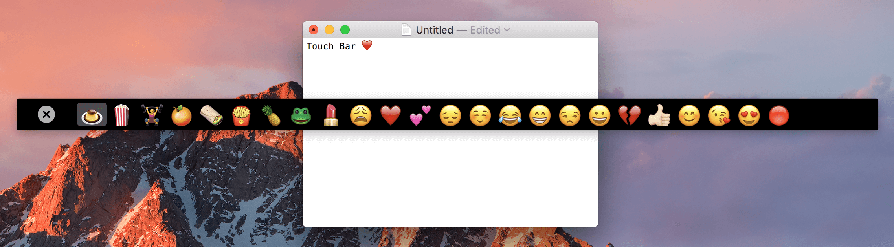
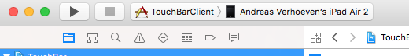

# Touch Bar Demo App

Touch Bar Demo App allows you to use your macOS Touch Bar from an iPad (through USB connection) or on-screen by pressing the Fn-key.

## Installation

Ensure you have installed [macOS Sierra 10.12.1 build 16B2657](https://support.apple.com/kb/dl1897).

Just fetch the latest ZIP from the [release section](https://github.com/bikkelbroeders/TouchBarDemoApp/releases) section and put the extracted app into your Applications folder.

To build the iOS app, open `TouchBar.xcodeproj`, connect your iOS device and select the TouchBarClient target and your device:

For sideloading the app, see [these instructions](http://bouk.co/blog/sideload-iphone/).

## Authors

* Andreas Verhoeven, <ave@aveapps.com>
* Robbert Klarenbeek, <robbertkl@renbeek.nl>

## Credits

* Thanks to [Alex Zielenski](https://twitter.com/#!/alexzielenski) for [StartAtLoginController](https://github.com/alexzielenski/StartAtLoginController), which ties together the ServiceManagement stuff without even a single line of code (gotta love KVO).

* Thanks to [Aleksei Mazelyuk](https://dribbble.com/mazelyuk) for his [Touch bar for VK Messenger](https://dribbble.com/shots/3057522-Touch-bar-for-VK-Messenger), which was an inspiration for the app icon.

* Thanks to [Rasmus Andersson](https://rsms.me/) for [peertalk](https://github.com/rsms/peertalk), which is used to communicate between the macOS and iOS apps through USB connection.

Thanks to [Bas van der Ploeg](http://basvanderploeg.nl) for testing and shooting a sample video.

## License

Touch Bar Demo App is published under the [MIT License](http://www.opensource.org/licenses/mit-license.php).
